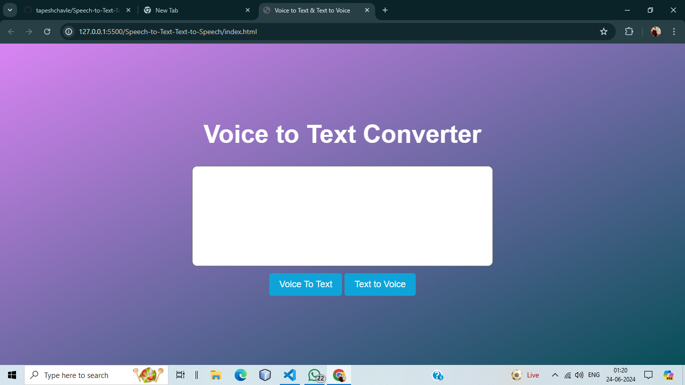

# Speech-to-Text and Text-to-Speech Converter

This project is a web application that allows users to convert speech to text and text to speech using HTML, CSS, and JavaScript. The application leverages the Web Speech API to implement both functionalities, providing an easy-to-use interface for users to interact with.

# Features

Speech-to-Text Conversion: Users can speak into their microphone, and their speech will be converted to text in real-time. 
Text-to-Speech Conversion: Users can input text, and the application will read it aloud using a synthesized voice. 
User-Friendly Interface: The application features a clean and intuitive interface, making it easy for users of all ages to use. 
Cross-Browser Compatibility: The application works on all modern browsers that support the Web Speech API. 

# Technologies Used

HTML5: Provides the basic structure of the application. 
CSS3: Used for styling the application, ensuring a visually appealing and responsive design. 
JavaScript: Implements the core functionality, including handling the Web Speech API for speech recognition and synthesis. 

# User Interface

</img>

# Installation and Setup

<pre>
Clone the repository:
Copy code
git clone https://github.com/tapeshchavle/Speech-to-Text-Text-to-Speech.git
Navigate to the project directory:
</pre>

# Usage

<strong>Speech-to-Text:</strong>

<pre>
Click on the "Start Recognition" button.
Speak into your microphone.
The recognized text will appear in the text area.
</pre>

<strong>Text-to-Speech:</strong>

<pre>
Enter the text you want to be read aloud in the text input area.
Click on the "Speak Text" button.
The application will read the text using a synthesized voice.
</pre>

# Contributing

If you have suggestions for improvements or find any bugs, please feel free to open an issue or submit a pull request.

tapeshchawle@gmail.com
